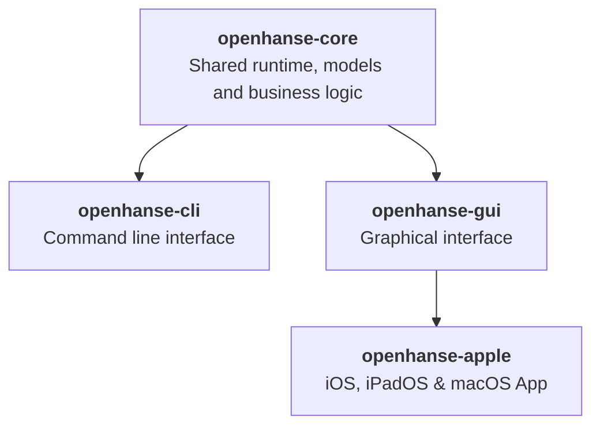
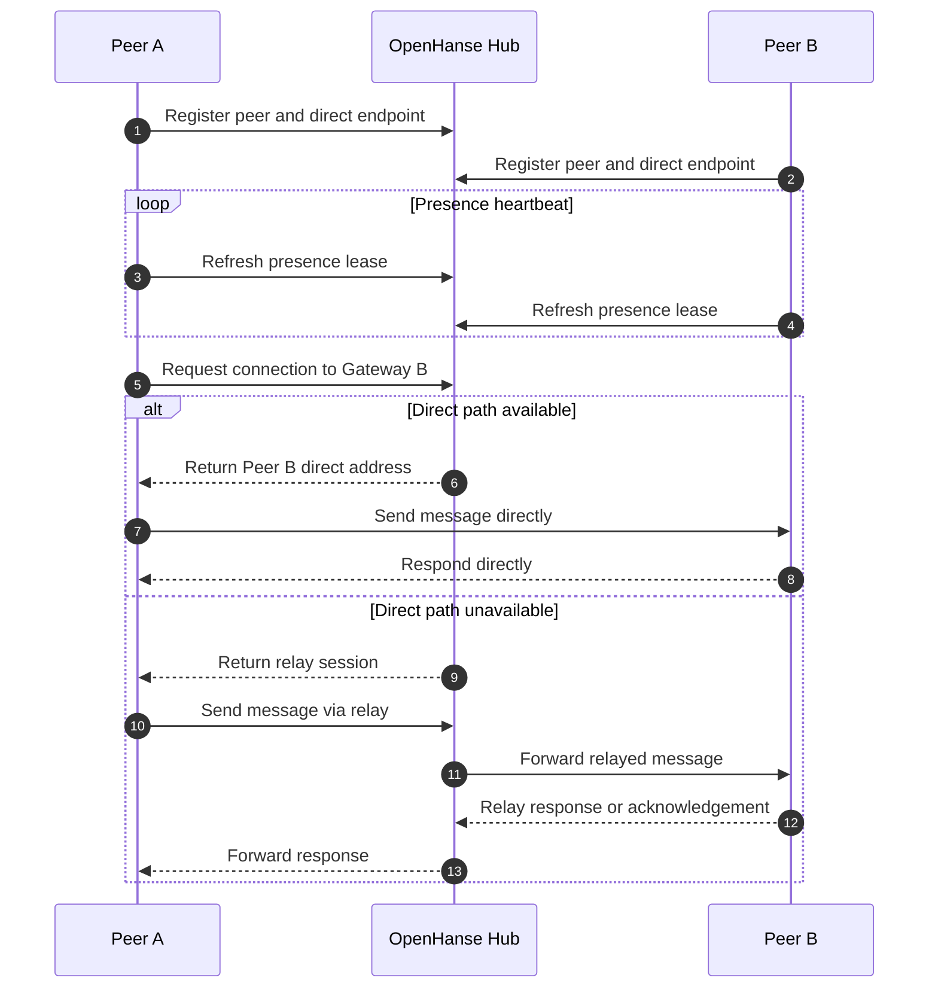

# OpenHanse Network - PARSEME

This document provides a structured overview of the OpenHanse Network project, including its layout, components, and technical stack. It serves as a guide for agentic contributors and stakeholders to understand the OpenHanse network's architecture.

## Goals

The OpenHanse Network project is organized into several key components, targets, and modules:

- single binary deployment to allow easy access for everyone
- Cascaded network topology with direct peer-to-peer communication and relay fallback
- application-level software-defined network interface with support for multiple protocols trough one tunnel approach
    - General flow:
        [Application data source]
        ↓
        [Encapsulation (SSH / TLS / VPN / Proxy)]
        ↓
        [Encrypted or forwarded transport]
        ↓
        [Decapsulation]
        ↓
        [Application data sink]
    - Common protocols for tunneling:
        - HTTP (Browser and API)
        - SSH (Remote terminal access)
        - FTP (File transfer)
        - WebSockets (Real-time communication)
        - gRPC (Remote procedure calls)
        - MQTT (IoT messaging)
        - General TCP/UDP (Custom applications like Chat, etc.)

## Non-goals

- VPN like solution as they require deep system integrationg which is particularly difficult on iOS and Android

## Compareable Solutions

Here is a list of some similar solutions in the market that can provide insights and inspiration for the OpenHanse Network project:

- **ZeroTier**: A software-defined network that allows users to create secure, private networks across the internet. It offers a single binary deployment and supports various platforms, including iOS, Android, Linux, macOS, and Windows. ZeroTier provides a virtual Ethernet port for seamless connectivity but may have limitations in terms of protocol support.
- **Tailscale**: A VPN service that simplifies secure access to devices and services. It uses the WireGuard protocol for encryption and offers a single binary deployment. Tailscale supports multiple platforms, including iOS, Android, Linux, macOS, and Windows. However, it may not provide the same level of protocol orchestration as our proposed solution.
- **VPN**: Provides secure remote access to networks by creating a virtual private network. It typically uses protocols like OpenVPN, WireGuard, or IPSec. While VPNs can offer secure connectivity, they may not provide the same level of protocol orchestration and may have limitations in terms of performance and compatibility with certain applications.

## Technical Stack (WIP)

### Protocol And Architecture

- SSH Tunneling vs. TLS Tunneling vs. SOCKS vs. Generic TCP/UDP Tunneling?
- IPv6 based identification and/or networking?
- Shared Rust Architecture

- Communication flow:
    - Peers register with the OpenHanse hub, keep their presence alive, and ask the shared runtime whether a message should go directly to another peer or fall back to a relay session.

### OpenHanse App

- OpenHanse for iOS, iPadOS, macOS, Android, Windows and Linux as general "demonstration" of functionality and use cases
- it can be seend as a reference implementation and "Swiss army knife" for interacting with the OpenHanse network and it's peers
- the mobile app could provide different "mini apps" for different protocols and use cases:
  - Chat (Custom protocol) like WhatsApp or Telegram
  - HTTP (Browser) like Safari or Chrome
  - HTTP (API) like Postman or Bruno
  - SSH (Terminal) like Termux
  - FTP like FileZilla
  - WebSockets
  - gRPC
  - MQTT